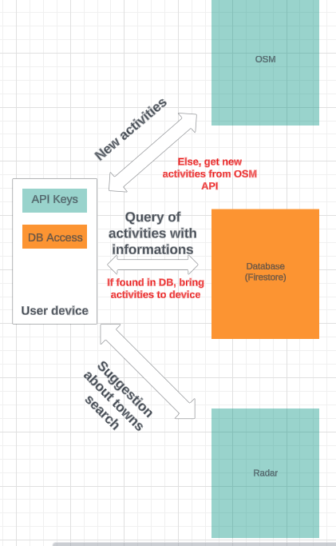

# Functional Requirements

## Key features of the MVP

The LASTA MVP aims to integrate 4 core features for users to discover, plan, and track outdoor activities : activities recommendations, detailed spot information, activitiy tracking, an offline mode and one non-critical feature to enhance user experience, a social system inside the app.

### Activity Recommendations

**Data Fetching:**
- **OSM API Integration:** Fetch hiking, climbing, and biking activities based on user-selected locality and radius, using the OpenStreetMap API.

**Activity Identification and Database Check:**
- **Activity ID Matching:** Identify activities using unique IDs from OSM.
- **Database Query:** Check if activities are in the database; if found, retrieve details (ratings, difficulty changes, etc.).

**Personalization and Recommendation:**
- **User Preferences Analysis:** Personalize recommendations based on user preferences.
- **Criteria-Driven Fetching:** Fetch new recommendations only when users change search criteria.

**User Interface and Experience:**
- **Recommendation Display:** Show recommended activities with details like distance, difficulty, and ratings.
- **Interactive Filters:** Allow users to refine recommendations using various filters.

**Locality Recommendation:**
- **Towns fetch:** User can type "Laus" and have a list of towns starting with "Laus" to select from, thanks to a Radar API call.

### Detailed Spot Information

- **Data Utilization:** Utilize all data available in the activity document, including ratings, difficulty levels, and user comments, don't make another call to the database, since the data is already fetched.
- **Rating System Implementation:** Enable users to rate activities, updating the "ratings" field in the database and linking the rating/comment to the activity and user ID.
- **Weather Forecast Integration:** Fetch weather forecast for the next 24 hours using OpenWeatherMap API at the activity's location, aiding users in deciding whether to proceed with the activity.

### Activity Tracking

- **GPS Position Retrieval:** Utilize GPS to track the device's position during the activity.
- **Data Storage:** Store activity details, including GPS data, in the "user_activities" collection in the database.
- **Feed Visibility:** Ensure that activities are visible to the user's friends in their feed for social interaction.

### Offline Mode

- **Caching with Android Room:** Utilize Android Room to cache useful pages for offline access.
- **User Profile Statistics:** Cache user statistics on their profile for offline viewing.
- **Favorites Activities:** Cache favorite activities for offline access.
- **GPS Independence:** Ensure GPS functionality remains operational offline, allowing users in remote areas to track activities normally.

### Social System

- **Conversations Retrieval:** Utilize database calls to fetch conversations with friends.
- **Notification Implementation:**
  - **Client-Side Request:** Send HTTP POST request with notification content from the app.
  - **Server-Side Processing:** Parse the content and trigger a Firebase notification queue.
  - **Firebase Real-Time Notification:** Utilize Firebase to send real-time notifications to Android OS devices via a token system.

