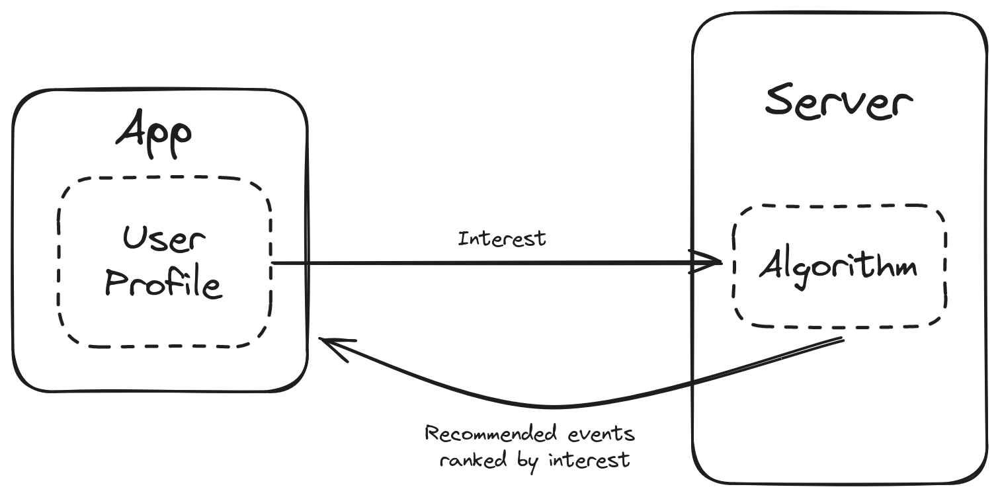

# Functional Requirements

## Key MVP Features

### Discovering Events

The process of discovering events should be seamless and straightforward for our users. Our goal is to enable users to open the app and find events that pique their interest within five minutes. Achieving this will require robust profile personalization and a sophisticated algorithm designed to match events with users accurately.

To ensure users get the most out of their profiles, the profile creation process will be guided and intuitive. Central to the event discovery process is the matching algorithm. To develop an effective algorithm, we will conduct a thorough review of existing solutions in the literature and refine our approach through intensive testing with beta users. We are confident that we can draw valuable insights from recommendation algorithms used in various social media platforms.

### Participating in Events

User participation in events is crucial for the success of our app. We aim to make the process of joining events as effortless as possible. Users should be able to join an event with no more than two clicks. To encourage participation, we will incorporate a prominent call-to-action button that makes it easy for users to engage with events they find interesting.

### Helping Associations Promote Events

Associations, as the primary creators of events, are vital to our platform. We aim to support them in making their events successful by providing them with a comprehensive admin interface. This interface will allow them to track event registration progress and compare current events with past ones. The admin interface will be designed to be highly intuitive and user-friendly, offering a wide range of customization options to meet the specific needs of each association.

## Key Internal Functionality

Given the potential computational demands of our algorithm, we plan to run it on our backend servers. This approach will ensure that users do not need to download all event data and rank them by interest on their devices, which would be inefficient and resource-intensive. By handling the heavy lifting on our backend, we can provide a smooth and efficient user experience.

