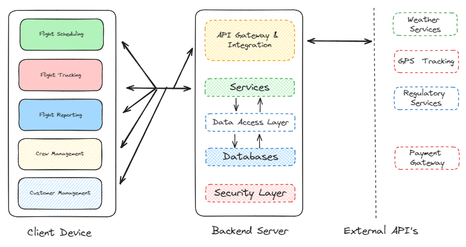

# Functional Requirements

## 1. Flight Scheduling System

### Motivation:

Balloon company operations depend on meticulous scheduling to manage multiple flights, pilots, and crew members daily. Current methods that rely on separate systems can lead to scheduling errors, inefficient use of resources, and customer dissatisfaction due to potential overbooking or understaffing.

### Proposed Solution:

Implement a dynamic, calendar-based scheduling system within the app that allows for real-time planning, adjustments, and cancellations. This system will integrate weather data to aid decision-making and include automated notifications to staff and customers regarding schedule changes.

## 2. Real-Time GPS Tracking

### Motivation:

Safety and precision in navigating hot-air balloons are paramount, and current solutions often require multiple devices or separate applications. Integrating GPS tracking directly into the operational app would streamline processes and enhance safety by providing exact locations in real-time.

### Proposed Solution:

Incorporate GPS functionality that tracks each balloon’s location during flights. Display this data on a map accessible by the pilot and ground crew within the app, enhancing coordination and response times in case of deviations or emergencies.

## 3. Crew Management System

### Motivation:

Managing crew schedules, qualifications, and availability through disparate systems is cumbersome and prone to error, affecting operational efficiency and compliance with aviation safety standards.

### Proposed Solution:

Develop a comprehensive crew management module that manages profiles, documents qualifications, tracks availability, and automates assignment processes based on role-specific attributes. This system will also handle alerts for certification renewals and training needs.

## 4. Post-Flight Reporting and Compliance

### Motivation:

Accurate and timely post-flight reporting is essential for regulatory compliance and operational analysis. Manual processes are time-consuming and susceptible to errors, which could lead to compliance issues and inefficiencies.

### Proposed Solution:

Automate the post-flight reporting process with pre-filled forms based on flight data. Enable pilots and crew to submit reports directly through the app, simplifying data entry and ensuring compliance. Integrate this system with regulatory reporting requirements for streamlined operations.

## 5. Customer Management System

### Motivation:

Enhancing customer relationship management is crucial for business growth and retention. Existing methods may not provide the integrated approach needed to track customer interactions, preferences, and feedback effectively.

### Proposed Solution:

Create a customer management feature that consolidates customer data, booking history, feedback, and communication. This tool will support targeted marketing campaigns and provide insights into customer behavior, improving service and customer satisfaction.

