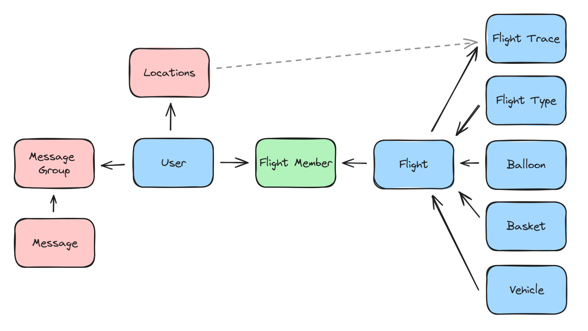

## Design and Implementation

## Frontend

#### Implementation framework

The application will be developed for Android using Kotlin. This approach ensures a modern, null-safe and efficient implementation of the app's UI and business logic.

#### Dynamic UI Rendering Strategy

Composed of two primary flows (Admin flow and Crew/Pilot flow), our JetBrains Compose based UI will render different screens depending on the type of user. This routing enables efficient navigation through app features.

- The Admin flow includes a Home screen featuring upcoming flights, User management screen, Chat screen, and a Statistics screen dedicated to finished flights.
- The Crew/Pilot flow includes a Home screen displaying user-specific upcoming flights, Flight screen handling in-flight procedures, Chat screen, and a Calendar for updating user availability and assigned flights.

#### Framework

Mainly, Jetpack Compose framework will be employed for UI realization. Tailored specifically for our immediate needs, the UI is not subjected to constant changes.

## Backend

The application relies on Firebase for backend services, creating a frontend-focused environment. The Firebase SDK serves as a communication medium with Firebase.

### Authentification

The application employs Firebase authentication mechanism. All users will be authenticated through Google, Facebook, Microsoft account or an email address.

### Database

Google Cloud Firestore, a No-SQL database, will be used for data storage. It supports live updates and limited queries. Firestore will be employed both for long-term data storage like user, vehicle, and balloon data and real-time updates like current user position or a flight status. Firestore-managed cache caters to the application's caching needs.

### Push notification

Firebase Cloud Messaging (FCM) will be used for push notifications. Notifications are triggered on receiving a message or the initiation of a flight.

## Data Model

The Firestore database will be structured much like a SQL database with specific collections (tables) defined for each schema and relations established among them. The system will also support versioning of schemas enabling smooth updates and maintenance of old data.

Database schemas comprise:

* Balloons, vehicles, baskets schemas for inventory.  
* Flight, flight types, flight traces, and flight-member relation schemas for flight lifecycle management.  
* Locations, message group, and message schemas for real-time updates and message storage.  

## Infrastructure and Deployment

Firebase infrastructure hosts the backend server enabling a seamless deployment process. A Firebase application will be provisioned for each client, and the costs associated will be recharged to the client.

An automated deployment process through Github actions will be set up to release the app on Google Play Store.

A monitoring service running as a python cron job will be deployed to aggregate logs and monitor Firestore usage. Alerts will be set up if certain quota limits are reached.

## Test Plan

Tests will be systematically carried out upon deployment/update.

#### UI Tests

Given the mainly static nature of the UI, extensive testing protocols will be developed to ensure user experience consistency.

#### Backend Tests
Consistency tests on the Firestore database will ascertain data integrity and correctness. Additionally, appropriate mockups of all Firebase products will be developed for a satisfactory testing environment.

#### Performance Testing

Performance tests will primarily focus on the Flight screen, particularly location tracking and recording functions - the expected bottlenecks. A stress test on messages and push notifications will also be done for smooth app functionality. Given the business nature of the app catering to a group of ~30 persons, high traffic is not a concern, still ensuring app performance is of utmost importance.